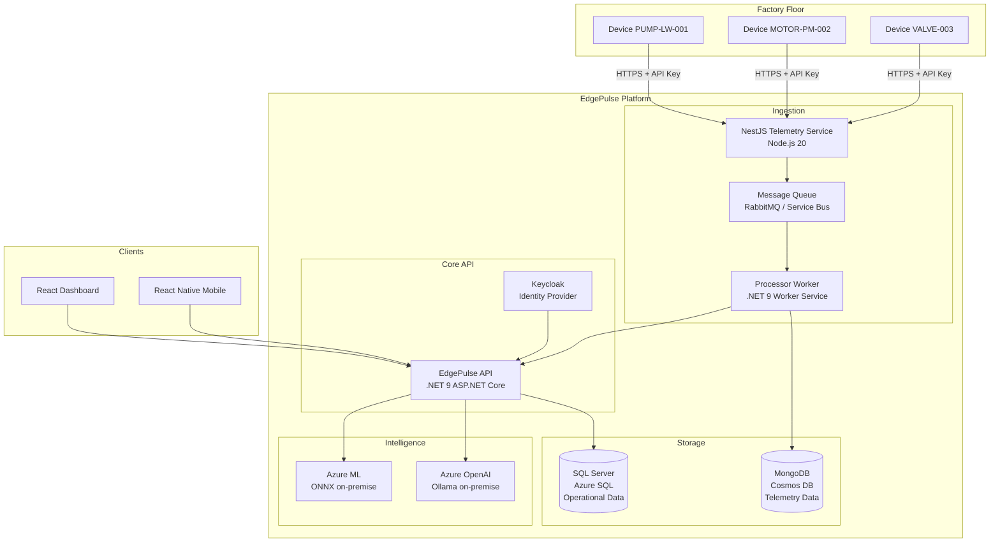
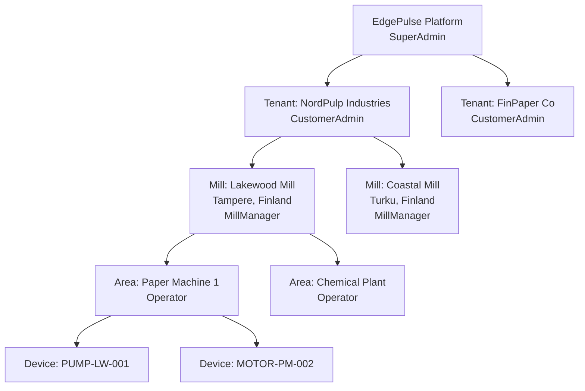
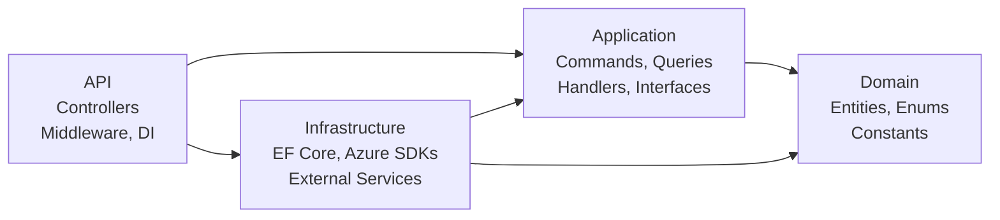
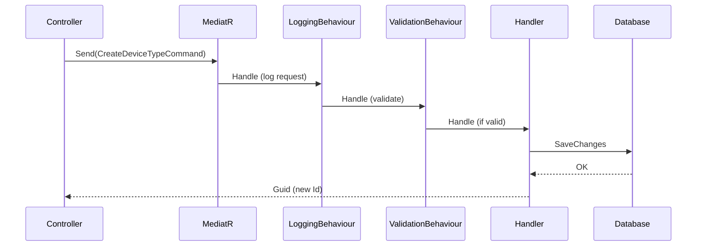
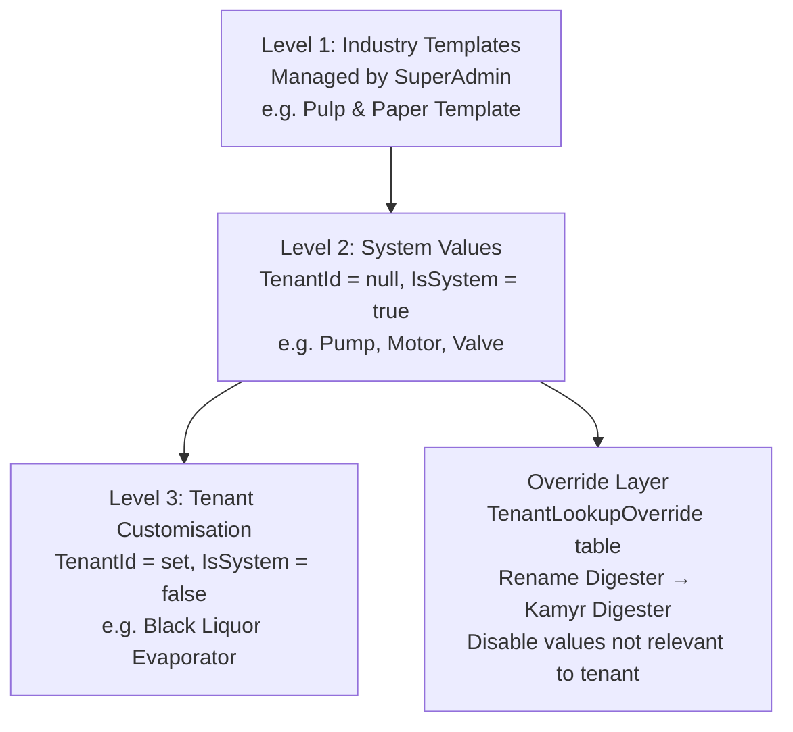
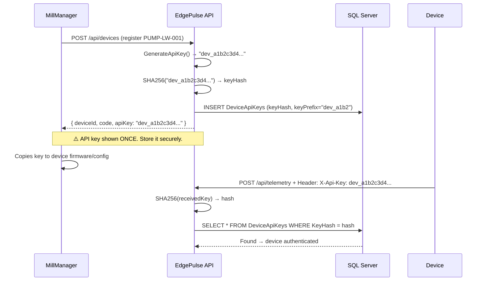
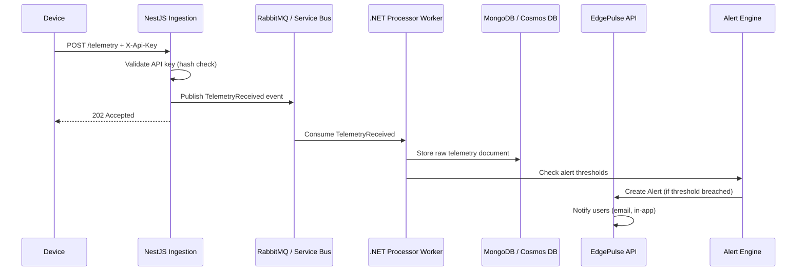

# EdgePulse — Architecture & Technical Decisions

> This document explains not just what was built, but why each decision was made.
> For each major decision: the context, options considered, and final choice.
> Last updated: May 2026

---

## Table of Contents

1. [System Overview](#1-system-overview)
2. [Clean Architecture](#2-clean-architecture)
3. [CQRS with MediatR](#3-cqrs-with-mediatr)
4. [Multi-Tenancy Strategy](#4-multi-tenancy-strategy)
5. [Lookup Table Architecture](#5-lookup-table-architecture)
6. [Dual Deployment Model](#6-dual-deployment-model)
7. [Database Choices](#7-database-choices)
8. [Identity & Authentication](#8-identity--authentication)
9. [API Design Decisions](#9-api-design-decisions)
10. [Device API Key Security](#10-device-api-key-security)
11. [Error Handling Strategy](#11-error-handling-strategy)
12. [Infrastructure Decisions](#12-infrastructure-decisions)
13. [Future Architecture (Telemetry Pipeline)](#13-future-architecture-telemetry-pipeline)

---

## 1. System Overview

EdgePulse is an Industrial IoT Device Management Platform built for mid-market manufacturers.
It connects to factory-floor devices, ingests their telemetry, detects anomalies, fires alerts,
and presents operational intelligence through dashboards and reports.

### High-Level Architecture



### Organisational Hierarchy



---

## 2. Clean Architecture

### Context

When starting EdgePulse, the first architectural decision was how to structure the .NET solution.
The options were: monolith with folders, vertical slice architecture, or Clean Architecture (Onion).

### Options Considered

**Option A: Simple MVC Monolith**
Fast to start, but business logic bleeds into controllers. Hard to test. Hard to swap
infrastructure (e.g. Azure Blob → MinIO). Not credible for a senior portfolio project.

**Option B: Vertical Slice Architecture**
Each feature is self-contained. Good for teams. But for a solo project building a platform,
it produces too much duplication and makes cross-cutting concerns (auth, logging) harder.

**Option C: Clean Architecture (chosen)**
Strict dependency rules with four layers. Domain has zero dependencies. Application depends
only on Domain. Infrastructure implements Application interfaces. API wires everything together.

### Why Clean Architecture

The dual deployment model (cloud vs on-premise) made this non-negotiable. Clean Architecture
lets us swap infrastructure implementations by injecting different services:

```
Cloud deployment:    inject AzureBlobStorageService, AzureServiceBusPublisher
On-premise:          inject MinIOStorageService, RabbitMQPublisher
Same Domain + Application code either way
```

The `IFileStorageService`, `ICurrentUserService`, and `IApplicationDbContext` interfaces in
the Application layer are the abstraction seams that make this possible.

### Dependency Rule Diagram



---

## 3. CQRS with MediatR

### Context

The application needs to support complex read queries (role-scoped, multi-joined, filtered)
alongside writes that enforce business rules. Mixing these in services leads to bloated classes
where a `DeviceService` ends up with 20 methods.

### Decision: CQRS with MediatR Pipeline

Commands (writes) and Queries (reads) are separated into distinct objects. MediatR routes
them to their handlers and runs pipeline behaviours (validation, logging) on every request.



### Why Not Simple Services?

The MediatR pipeline provides logging and validation for free on every request.
Adding a new feature means adding a new Command/Query file — not modifying an existing service.
The codebase scales horizontally: 100 features = 100 small focused files, not 10 bloated services.

### Key Rule: Commands Never Read, Queries Never Write

```csharp
// GetDevicesQuery NEVER modifies state — even "update last viewed" would be wrong here
// CreateDeviceCommand NEVER returns a full DTO — just the new Id
// This separation makes it trivially easy to add read replicas later
```

---

## 4. Multi-Tenancy Strategy

### Context

EdgePulse serves multiple customers (tenants) from a single database. The question was
how to isolate tenant data: separate databases, separate schemas, or shared tables with TenantId.

### Options Considered

**Option A: Database per Tenant**
Perfect isolation, easy backup per tenant. But expensive at scale — 100 tenants = 100 databases.
No cross-tenant analytics. Migration management nightmare.

**Option B: Schema per Tenant**
Good isolation. But SQL Server schema management is complex. EF Core multi-schema support
is limited.

**Option C: Shared Database with TenantId (chosen)**
All tenants share tables. Row-level isolation via TenantId foreign key. EF Core Global Query
Filters automatically add `WHERE TenantId = @CurrentTenantId` to every query.

### Why Shared Database

For an industrial IoT product targeting 50-500 employee companies, tenants will have
hundreds to low thousands of devices, not millions. Shared database is appropriate at this scale.
The Global Query Filter approach means developers can never accidentally leak cross-tenant data —
the filter is applied at the DbContext level, not in application code.

```csharp
// In EdgePulseDbContext.OnModelCreating():
modelBuilder.Entity<Device>()
    .HasQueryFilter(d => !d.IsDeleted &&
                         d.TenantId == _currentUserService.TenantId);

// Now every query automatically adds WHERE TenantId = '...' AND IsDeleted = 0
// Developer writes: _context.Devices.Where(d => d.Code == "PUMP-001")
// EF Core executes: SELECT * FROM Devices WHERE Code = 'PUMP-001'
//                   AND TenantId = '...' AND IsDeleted = 0
```

---

## 5. Lookup Table Architecture

### Context

An industrial IoT platform needs many configurable value lists: device types, statuses,
alert severities, metric types, etc. The question was: hardcode these, use enums, or use
a database-driven configuration system.

### The Problem With Enums

A paper mill in Finland uses "Kamyr Digester". A food factory uses "Conveyor Belt".
A wind farm uses "Turbine Assembly". If we hardcode device types as enums, every customer
needs a developer to add their equipment vocabulary. That's not a SaaS product.

### Decision: Three-Level Configuration Hierarchy



**System values** (`TenantId = null`, `IsSystem = true`) are seeded with well-known GUIDs.
They cannot be deleted — only overridden per tenant. This protects referential integrity.

**Custom values** (`TenantId = <id>`, `IsSystem = false`) are created by CustomerAdmin
through the UI. No developer needed.

**Overrides** (`TenantLookupOverride`) let a tenant rename "Digester" to "Kamyr Digester"
or hide "Pump" if they don't use pumps. The original system value is unchanged for other tenants.

### Well-Known GUID Strategy

System seed values use deterministic GUIDs with readable prefixes:

```csharp
// Constants/WellKnownIds.cs
public static class GenericDeviceStatusIds
{
    public static readonly Guid Online = Guid.Parse("00000032-0000-0000-0000-000000000001");
    public static readonly Guid Offline = Guid.Parse("00000032-0000-0000-0000-000000000002");
}
```

This means seed data is idempotent — running migrations twice won't create duplicate statuses.
It also means application code can reference specific well-known statuses by constant
rather than by a magic string that could break if a name changes.

---

## 6. Dual Deployment Model

### Context

The biggest competitive differentiator for EdgePulse is on-premise support. Many paper mills
have no reliable internet connection on the factory floor. A cloud-only product would be
a non-starter for them.

### Decision: Same Codebase, Switched by Environment Variable

```
DEPLOYMENT_MODE=Cloud      → injects Azure implementations
DEPLOYMENT_MODE=OnPremise  → injects Docker/on-premise implementations
```

| Concern | Cloud | On-Premise |
|---------|-------|------------|
| Primary DB | Azure SQL | SQL Server 2022 (Docker) |
| Telemetry DB | Azure Cosmos DB | MongoDB (Docker) |
| Message Queue | Azure Service Bus | RabbitMQ (Docker) |
| File Storage | Azure Blob | MinIO (Docker) |
| Identity | Keycloak + Azure AD | Keycloak + on-premise AD |
| Load Balancer | Azure Container Apps | HAProxy (Docker) |
| AI | Azure OpenAI | Ollama llama3.2 (Docker) |
| ML | Azure ML | ONNX Runtime (local) |

The Infrastructure DI registration switches implementations based on `DEPLOYMENT_MODE`:

```csharp
// Infrastructure/DependencyInjection.cs
if (deploymentMode == DeploymentMode.Cloud)
    services.AddScoped<IFileStorageService, AzureBlobStorageService>();
else
    services.AddScoped<IFileStorageService, MinIOStorageService>();
```

Application layer never knows which implementation is running. This is Clean Architecture
delivering its core promise: infrastructure is a detail.

---

## 7. Database Choices

### SQL Server for Operational Data

**Why SQL Server over PostgreSQL:** The target customers are industrial manufacturers.
Their IT teams know SQL Server. On-premise deployments using existing SQL Server licenses
is a real sales argument. The Azure SQL / SQL Server 2022 consistency simplifies operations.

**Schema design principles:**
- All tables have `IsDeleted` + `DeletedAt` (soft delete everywhere)
- All tables have `CreatedAt` + `UpdatedAt` (UTC)
- Tenant-scoped tables have `TenantId` FK
- Unique indexes filter on `IsDeleted = 0` (allows reuse of codes after soft delete)

```sql
-- Example: Mill code unique within tenant, but allows re-registration after soft delete
CREATE UNIQUE INDEX IX_Mills_TenantId_Code
ON Mills (TenantId, Code)
WHERE IsDeleted = 0;
```

### MongoDB / Cosmos DB for Telemetry

Telemetry data is time-series: device ID + timestamp + metric values. Relational databases
are a poor fit for this write-heavy, query-by-time-range workload.

MongoDB's document model lets us store variable-shape telemetry payloads without schema
migrations every time a device type adds a new metric. Cosmos DB's partitioning by `deviceId`
ensures fast time-range queries per device.

```
Cosmos DB partition key = deviceId
Query pattern: "Give me Temperature for PUMP-LW-001 for the last 24 hours"
→ Single partition hit → sub-10ms query at scale
```

---

## 8. Identity & Authentication

### Context

The system has 5 roles with different scopes. Operators are restricted to specific areas.
MillManagers are restricted to their mill. This level of fine-grained access control needs
a proper identity provider, not custom JWT code.

### Decision: Keycloak (Sprint 4 — not yet built)

Keycloak handles:
- JWT issuance and validation
- Azure AD SSO (for cloud customers using Microsoft 365)
- On-premise Active Directory / LDAP (for factories with existing AD)
- Role assignment and group membership
- Multi-factor authentication

The JWT will carry custom claims:
```json
{
  "sub": "user-uuid",
  "tenantId": "00000099-...",
  "role": "MillManager",
  "millId": "mill-uuid",
  "areaIds": ["area-uuid-1", "area-uuid-2"]
}
```

`CurrentUserService` will read these claims and expose them to handlers.

### Current Placeholder

Until Sprint 4, `CurrentUserService` returns hardcoded `SuperAdmin` values.
The interface contract is already defined — swapping implementations is a single DI change.

---

## 9. API Design Decisions

### RESTful Resource Hierarchy

```
/api/configuration/device-types        Lookup configuration
/api/configuration/device-statuses
/api/organisation/tenants              Organisational hierarchy
/api/organisation/mills
/api/organisation/areas
/api/devices                           Device management
/api/telemetry                         [Sprint 5]
/api/alerts                            [Sprint 6]
```

### Separation of Request Model from Command

Early in Sprint 1, we discovered that passing MediatR Command records directly as
`[FromBody]` parameters causes ASP.NET model binding issues — the type name leaks into
the Swagger schema and validation errors reference `command` instead of field names.

**Decision:** Every POST/PUT endpoint uses a separate `XxxRequest` record defined at the
bottom of the controller file, which is then mapped to the Command in the action method.

```csharp
// Request model stays in API layer
public record CreateDeviceTypeRequest(string Name, string Code, ...);

// Mapping happens in controller
var id = await _mediator.Send(
    new CreateDeviceTypeCommand(request.Name, request.Code, ...), ct);
```

### HTTP Status Codes

| Scenario | Status |
|----------|--------|
| Successful read | 200 OK |
| Successful create | 201 Created |
| Successful update/delete | 204 No Content |
| Validation failure | 400 Bad Request |
| Not authenticated | 401 Unauthorized |
| Not authorised | 403 Forbidden |
| Not found | 404 Not Found |
| Conflict (duplicate, in-use) | 409 Conflict |
| Server error | 500 Internal Server Error |

---

## 10. Device API Key Security

### Context

Physical devices need to authenticate to send telemetry. They cannot use user credentials
(no UI, no OAuth flow). They need a static credential that's simple to configure once.

### Decision: SHA-256 Hashed API Keys, Shown Once



The plain text key is **never stored**. Only the SHA-256 hash is persisted.
If a key is lost, a new one must be generated (old one revoked).
The `KeyPrefix` (first 8 chars) is stored for display in the UI so admins can identify
which key is which without exposing the full key.

---

## 11. Error Handling Strategy

### Problem

Without centralised error handling, each controller method needs try/catch blocks,
and the error response format is inconsistent.

### Decision: ExceptionHandlingMiddleware + Domain Exceptions

The middleware sits in the ASP.NET pipeline and catches all unhandled exceptions:

```csharp
app.UseMiddleware<ExceptionHandlingMiddleware>(); // registered first
```

Domain exceptions map to HTTP status codes:

```csharp
exception switch
{
    ValidationException ex   => (400, ex.Errors),
    NotFoundException ex     => (404, ex.Message),
    ForbiddenAccessException => (403, "No permission"),
    ConflictException ex     => (409, ex.Message),
    _                        => (500, "Unexpected error")
}
```

This means handlers throw meaningful domain exceptions and controllers return clean responses.
No try/catch in application code. Consistent `ProblemDetails` JSON format on every error.

---

## 12. Infrastructure Decisions

### HAProxy for On-Premise Load Balancing

Most on-premise IoT deployments need zero-downtime updates. HAProxy was chosen over nginx
because it supports fine-grained backend state management (Active/Drain/Inactive) that allows
rolling deployments without dropping in-flight telemetry connections.

```
HAProxy States:
  Active  → receives new connections + keeps existing
  Drain   → keeps existing connections, no new ones (graceful shutdown)
  Inactive → no connections (fully stopped)
```

### Keycloak + PostgreSQL (not SQL Server)

Keycloak has first-class PostgreSQL support and its own internal schema management.
Running it against SQL Server is possible but adds complexity. PostgreSQL in Docker
is the standard Keycloak deployment pattern and is well-documented.

### RabbitMQ for On-Premise Message Queue

Azure Service Bus is cloud-only. For on-premise deployments without internet, RabbitMQ
provides equivalent messaging semantics (exchanges, queues, routing keys) in Docker.
The application code uses an `IMessagePublisher` interface — the implementation switches
between `AzureServiceBusPublisher` and `RabbitMQPublisher` based on `DEPLOYMENT_MODE`.

---

## 13. Future Architecture (Telemetry Pipeline)

This section documents the planned architecture for Sprint 5.

### Why Node.js for Telemetry Ingestion?

The telemetry ingestion endpoint will handle thousands of concurrent device connections.
Node.js/NestJS is better suited for high-concurrency I/O-bound workloads than .NET
(though .NET is catching up). More importantly, the IoT/embedded community uses JavaScript
SDKs. A NestJS service also serves as a demonstration of polyglot architecture — showing
interviewers that the codebase is not monoglot.

### Telemetry Flow



The 202 Accepted pattern ensures the device is never blocked waiting for storage or
alert evaluation. Devices operate in hostile environments with unreliable networks —
they should fire-and-forget telemetry as fast as possible.
